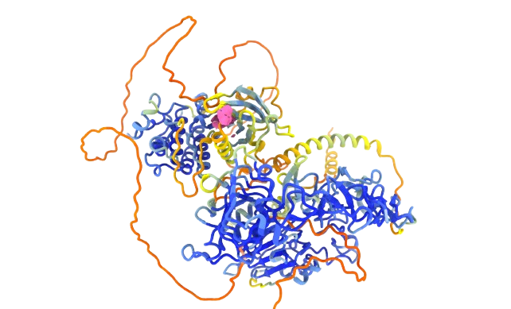

# 🧬 EGFR–Gefitinib Pseudo Docking with Chimera

This micro-project, located in the base folder **EGFR_PSEUDO_DOCKING_ANALYSIS**, illustrates a manual molecular modeling workflow using **UCSF Chimera**. The focus is a *pseudo docking* exercise where the tyrosine kinase inhibitor **Gefitinib** was positioned into the **Epidermal Growth Factor Receptor (EGFR)** binding site.

The workflow embedded in the `.cxc` session file combines:

* Structural alignment between an **AlphaFold-predicted EGFR model** and an available **experimental PDB structure** to ensure correct orientation and comparison.
* Manual placement of **Gefitinib** into the ATP-binding pocket guided by steric complementarity and visual inspection.
* Preparation of a clean visualization layout optimized for analysis and figure generation.

The purpose is to generate a structural snapshot that highlights how Gefitinib could occupy the active site of EGFR, without involving automated docking calculations.

---

## 📁 Repository Structure

```
EGFR_PSEUDO_DOCKING_ANALYSIS/
├── egfr_gefitinib.cxc        # Chimera session file
└── asset/
    └── IMG/
        └── final_result.png  # Rendered image of the docking pose
```

---

## 🖼️ Visualization Snapshot



---

## 🚀 Usage

1. Open UCSF Chimera (v1.15 or compatible).
2. Load `egfr_gefitinib.cxc`.
3. Inspect the aligned AlphaFold and PDB-derived receptor structures.
4. Explore the manually positioned ligand in the binding pocket.

---

## ⚠️ Technical Note

This is a *pseudo docking* project. It does not include energy minimization, scoring, or automated docking algorithms. The ligand placement is guided by visual inspection after structural alignment.

For physically meaningful docking or MD refinement, refer to:

* [AutoDock Vina](http://vina.scripps.edu/)
* [RosettaLigand](https://www.rosettacommons.org/docs/latest/application_documentation/structure_prediction/rosettaligand)
* [GROMACS](http://www.gromacs.org/)

---

## 🧠 Motivation

This workflow provides a fast, hypothesis-driven approach to visualize protein–ligand interactions:

* Supports illustrative figures and teaching material.
* Provides a preliminary exploration of ligand binding modes.
* Demonstrates alignment of predicted and experimental protein structures in the same framework.

---

> ☕ When you can't even enjoy a coffee because you have ideas upon ideas.
